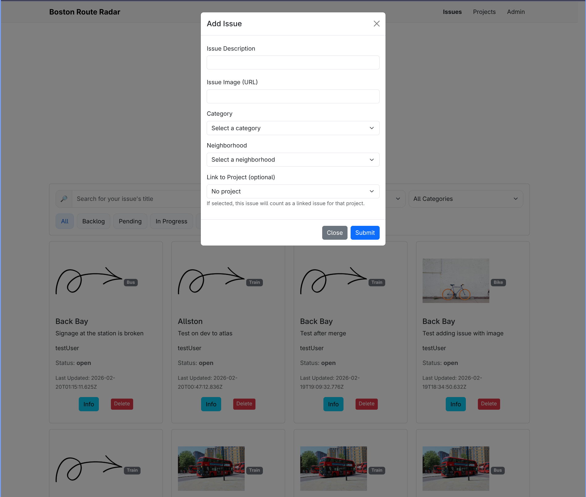
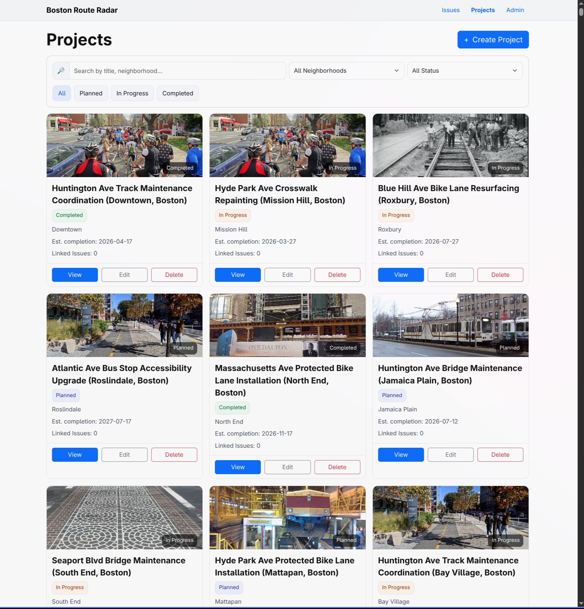
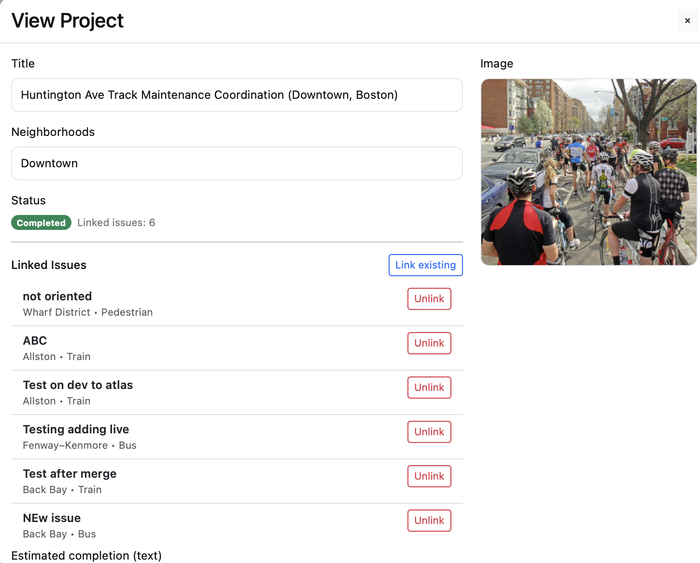
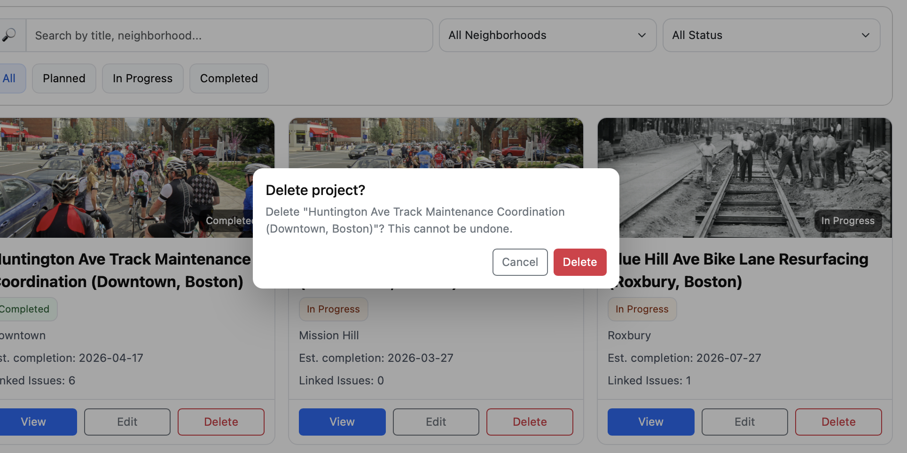

# 🚦 Boston Route Radar


A civic web application that enables cities to crowdsource and track transportation infrastructure issues — potholes, broken signals, flooded bike lanes, and more. Built for Boston, designed to scale.

---

## 📋 Table of Contents

- [Objective](#objective)
- [Features](#features)
- [Upcoming Features](#upcoming-features)
- [Tech Stack](#tech-stack)
- [Project Structure](#project-structure)
- [Installation](#installation)
- [API Overview](#api-overview)
- [Design, Mockups, and Demo](#Design-Mockups-and-Demo)
- [Attributions and AI](#attributions)
- [Authors and Course Information](#authors-and-course-information)

---

<a name="objective"> ## 🎯 Objective

### Course Objectives

Boston Route Radar is a full-stack web application built for CS5610 Web Development at Northeastern University. The project demonstrates:

- Building and consuming a Restful APIs with Node.js and Express
- Integrating a NoSQL database (MongoDB) for persistent storage
- Applying modern UI frameworks (Bootstrap) for aesthetically pleasing and responsive design
- Implementing full CRUD operations across multiple data collections
- Deploying the application and database

### Broader Objectives

Create a practical civic tool that:

- Empowers residents to report and track local infrastructure issues
- Gives city officials visibility into active, backlog, and resolved problems
- Surfaces city-led projects so the public can stay informed
- Bridges the gap between government and the communities they serve

---

## ✨ Features

### Issues Tracker

Residents can submit infrastructure issues (e.g. potholes, broken signals, downed signage) and view all active reports submitted by the community. Each issue card displays a photo, description, location, status, and a button to edit the information or delete the issue.

### City Projects Tracker

A page that will surface official city projects — infrastructure initiatives, road resurfacing plans, transit improvements, and more.

This feature brings transparency to city government by connecting residents with the work being done on their behalf.

### Filtering & Status Views

Issues can be browsed with filters to show all community issues or just your own submissions. Status indicators help distinguish between active, in-progress, and resolved reports.

---

## Screenshots

### Issues






## 🔧 Tech Stack

### Backend

-  **Node.js** — Runtime environment
-  **Express** — RESTful API server
-  **MongoDB** — NoSQL database for issues, alerts, and projects

### Frontend

-  **Bootstrap 5** — Responsive UI components and grid
-  **ES6+ JavaScript** — Dynamic rendering and API consumption
-  - Semantic page structure
-  - Styling

### Development

- **Git** — Version control
- **ESLint** — Code quality and consistency
- **Arch Linux + Neovim** — Development environment 😎

---

## 📁 Project Structure

```
boston_route_radar/
├── backend.js          # Express app entry point
├── routes/             # API route handlers
├── db/                 # MongoDB connection and helpers
├── data/               # Seed data / static assets
├── frontend/           # HTML pages and client-side JS
├── .gitignore
├── package.json
└── README.md
```

---

## 💻 Installation

Instructions on how to run the application

### Prerequisites

- Node.js (v18+)
- MongoDB (local instance or MongoDB Atlas URI)
- Git

### Setup

1. **Clone the repository:**

   ```bash
   git clone https://github.com/loganpaulmatheny/boston_route_radar.git
   ```

2. **Navigate to the project directory:**

   ```bash
   cd boston_route_radar
   ```

3. **Install dependencies:**

   ```bash
   npm install
   ```

4. **Configure environment variables:**

   Create a `.env` file in the root directory:

   ```
   MONGO_URI=your_mongodb_connection_string
   PORT=3000
   ```

5. **Start the server:**

   ```bash
   node backend.js
   ```

6. **Open in browser:**
   ```
   http://localhost:3000
   ```

---

## 🔌 API Overview

| Method   | Endpoint                     | Description                                                           |
| -------- | ---------------------------- | --------------------------------------------------------------------- |
| `GET`    | `/api/issues`                | Fetch all infrastructure issues                                       |
| `GET`    | `/api/issues?projectId=<id>` | Fetch issues linked to a project (projectId stored as string)         |
| `GET`    | `/api/issues?unlinked=true`  | Fetch only unlinked issues (no projectId)                             |
| `POST`   | `/api/issues`                | Submit a new issue                                                    |
| `PUT`    | `/api/issues/:id`            | Update an issue (including linking or unlinking by setting projectId) |
| `DELETE` | `/api/issues/:id`            | Delete an issue                                                       |
| `GET`    | `/api/projects`              | Fetch all city projects (includes linkedIssues count)                 |
| `POST`   | `/api/projects`              | Create a new project                                                  |
| `PUT`    | `/api/projects/:id`          | Update a project                                                      |
| `DELETE` | `/api/projects/:id`          | Delete a project                                                      |

---

## 🎨 Design, Mockups, and Demo

#### [Design Document](https://docs.google.com/document/d/1mQpv4x2_FTDfwvrKBbPpvTOqKNteUNoMVR5khnlfjzI/edit?usp=sharing)

#### [Presentation](https://docs.google.com/presentation/d/1qXckxGZW3NcSI1Ku2qwDHa9Wfr39dWP4maF2xt38PYk/edit?usp=sharing)

#### [Demo](https://drive.google.com/file/d/1lQupgfu74Kh24C-vyDXEHLNM09D1QEbx/view?usp=sharing)

---

## Attributions

### Creator Attributions

- [Logo](https://www.figma.com/community/file/1018477313212753754/hand-drawn-shapes)
- [Bootstrap 5 UI Kit](https://www.figma.com/community/file/876022745968684318)
- [Design Doc Example](https://docs.google.com/document/d/1Ec-meutJBaaw4cw0w6GMzTTqJfABBZgBzkpjO-1rq8E/edit?tab=t.ykzohr99uo7z)
- [Presentation Example](https://docs.google.com/presentation/d/13cU8w33jNEzF5RX6STwZbzTthm9KhT3fNp5iPCyrMwk/edit?slide=id.g389c7506f58_0_1427#slide=id.g389c7506f58_0_1427) and previous presentation made by Logan Matheny
- ApartmentFinder App created by Prof. Gomez served as main inspiration for layout

## 🤖 AI Assistance

### How AI Was Used

**Issues Usage** - A combination of Claude and Gemini were utilized in learning more about how NodeJS, MongoDB, and Express all work together. For more specific technical challenges, AI was used in some of the following examples:

- Assistance with 'injecting' the cards correctly into the issues div element and preserve the correct dimension, rows, columns, etc...
- Creating and utilizing the update modal
- Understanding how and where to place event listeners on the buttons controlling update and delete. Should they get placed one time? During the creation of each card? etc...

**README Documentation** — Claude AI was used to help structure and format this README based on project details and a preferred style from a prior project. The repository owners then made adjustments and modifications as necessary.

**Debugging & Troubleshooting** — AI assisted with diagnosing Express routing issues, MongoDB query patterns, and Bootstrap layout behavior.

**Deployment** - AI was used to assist in the deployment process as this is one of the contributors first deploying with Render.

### AI Usage Philosophy

AI was used as a **development accelerator**, not a shortcut. All generated code was reviewed, understood, and integrated intentionally. The goal was to spend less time on boilerplate and more time building features that matter.

---

## 👨‍💻 Authors and Course Information

**Logan Matheny**

- 🎓 Graduate Student, M.S. Computer Science — Northeastern University
- 🪖 West Point Graduate and U.S. Army Veteran
- 💼 [LinkedIn](https://www.linkedin.com/in/logan-matheny/)
- 🐙 [GitHub](https://github.com/loganpaulmatheny)
- Predominantly focused on issues collection and functionality

**Pratyusha Jaitly**

- 🎓 Graduate Student, M.S. Computer Science — Northeastern University
- 🐙 [GitHub](https://github.com/pratyushajaitly)
- Predominantly focused on projects collection and functionality

**Course Information**
Class Link

- **Course**: CS5610 Web Development
- **Semester**: Spring 2026
- **Instructor**: John Guerra Gomez
- **Course Website**: [CS5610 Online Spring 2026](https://johnguerra.co/classes/webDevelopment_online_spring_2026/)

---

## 📝 License

MIT License — see [LICENSE](./LICENSE) for details.

---

**Made with 🦺 by Logan Matheny & Pratyusha Jaitly**

_Last Updated: February 2026_
